# Eventify – Full Stack Event Booking Platform

Eventify is a modern **MERN stack event booking system** with OTP verification, secure authentication, and a smooth user experience. It allows users to explore events, book tickets, and manage bookings, while admins can control events and bookings efficiently.

---

## 🌐 Live Demo

🔗 https://eventify-ruby.vercel.app

---

## ✨ Features

### 👤 User Features

* 🔐 JWT Authentication (Login/Register)
* 📩 Email OTP Verification
* 🎫 Browse & Book Events
* 📊 User Dashboard (View bookings)
* 💳 Booking Confirmation Flow

### 🛠️ Admin Features

* 📋 Admin Dashboard
* ➕ Create / Edit / Delete Events
* 📦 Manage All Bookings
* ✅ Confirm Bookings

---

## 🧱 Tech Stack

### Frontend

* React.js (Vite)
* Tailwind CSS
* React Router DOM
* Axios

### Backend

* Node.js
* Express.js
* MongoDB + Mongoose
* JWT Authentication
* Nodemailer (Email OTP)

---

## 📁 Project Structure

```
Eventify/
├── client/       # Frontend (React + Vite)
├── server/       # Backend (Node + Express)
```

---

## ⚙️ Installation & Setup

### 1️⃣ Clone the repository

```bash
git clone https://github.com/Sourabh-Bhalse/Eventify.git
cd Eventify
```

---

### 2️⃣ Setup Backend

```bash
cd server
npm install
```

Create `.env` file:

```
MONGODB_URL=your_mongodb_url
JWT_SECRET=your_secret
EMAIL_USER=your_email
EMAIL_PASS=your_password
```

Run backend:

```bash
npm run dev
```

---

### 3️⃣ Setup Frontend

```bash
cd client
npm install
npm run dev
```

---

## 🚀 Deployment

* **Frontend**: Vercel
* **Backend**: Render

👉 Added SPA routing fix using `vercel.json` for React Router support.

---

## 🧠 Key Learnings

* Handling **JWT Authentication & Protected Routes**
* Implementing **OTP Verification System**
* Fixing **SPA routing issues on Vercel**
* Managing full-stack deployment (Frontend + Backend)

---

## 📸 Screenshots
## 📸 Screenshots

### 🏠 Home Page


### 🎫 Events Page

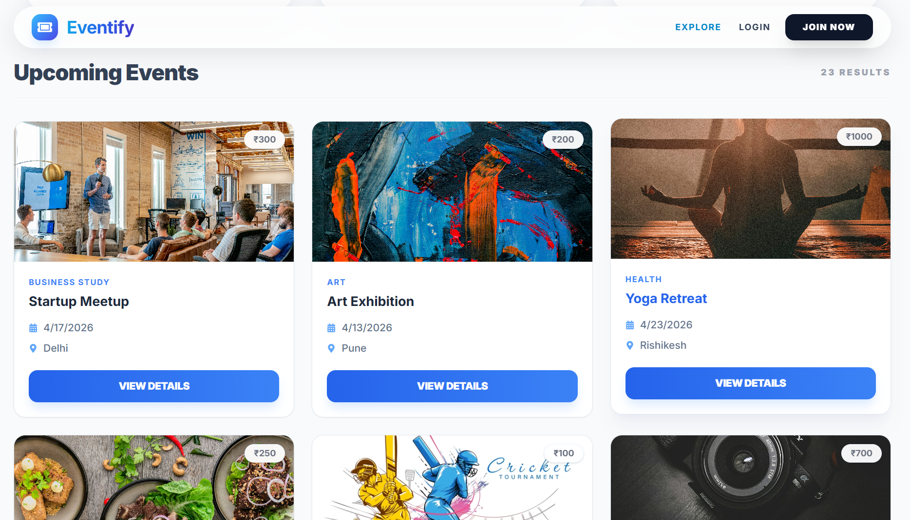
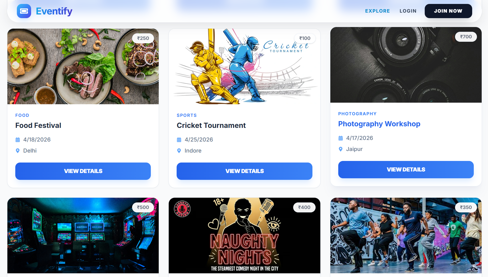

### 🔐 Login & Register

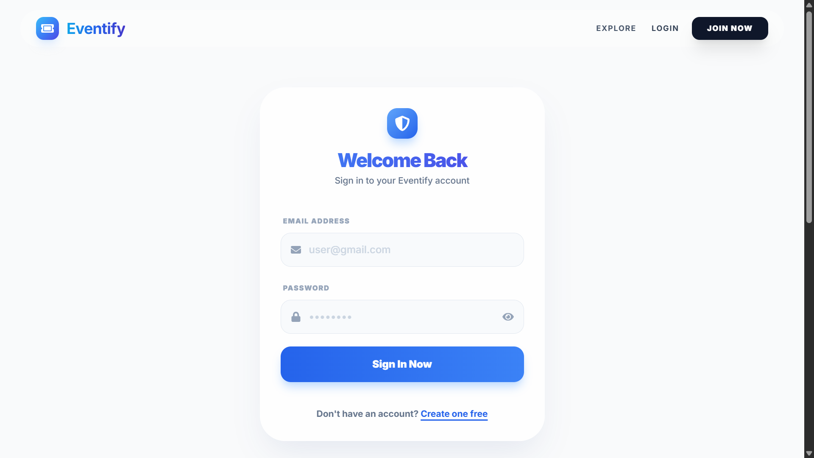
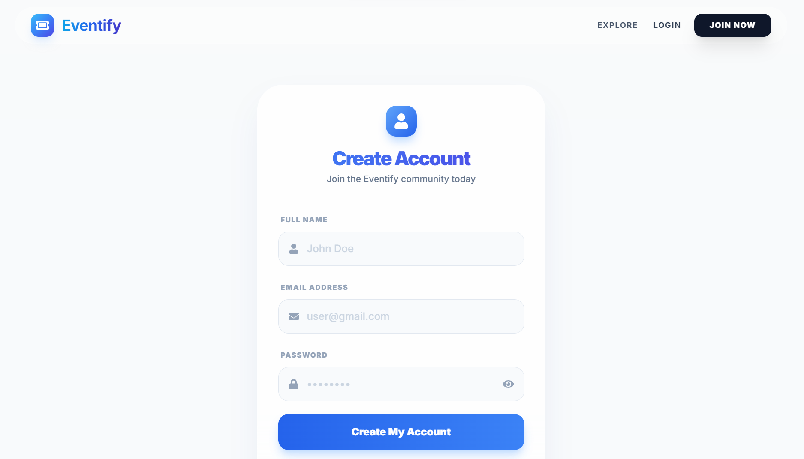
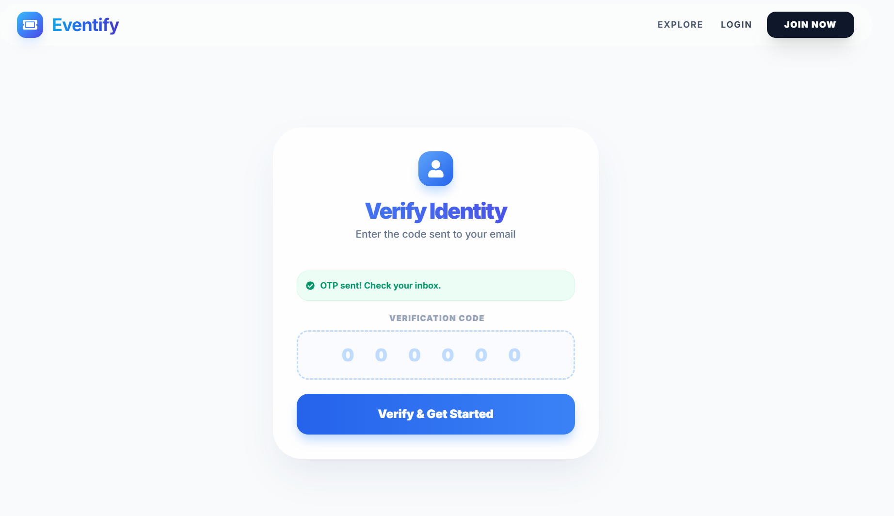

### 👤 User Dashboard

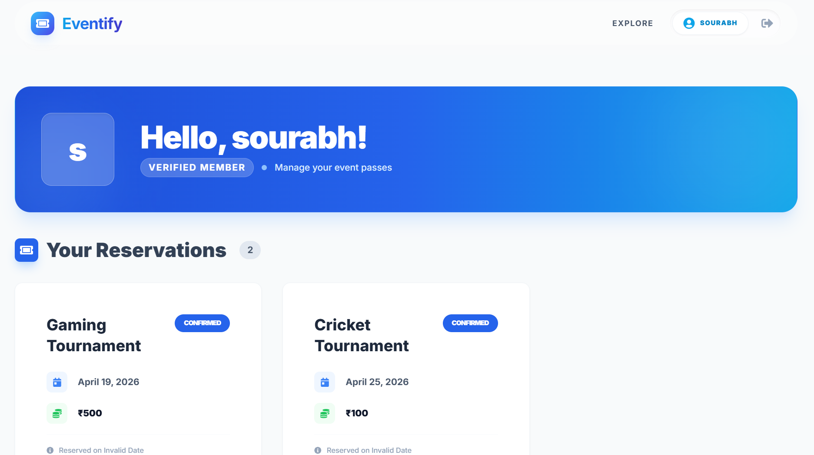
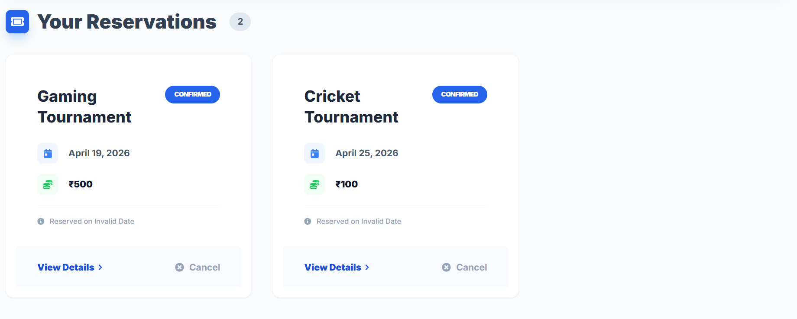

### 🛠️ Admin Dashboard

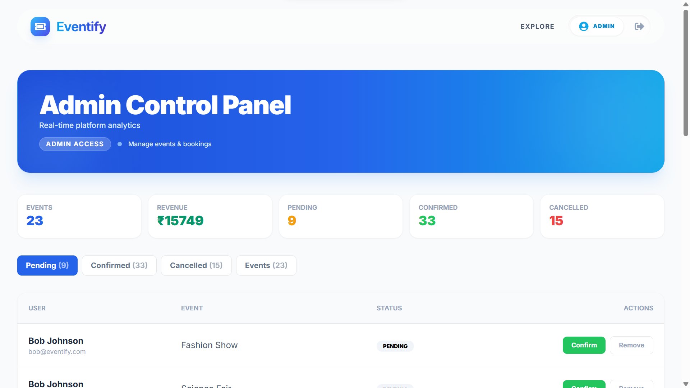
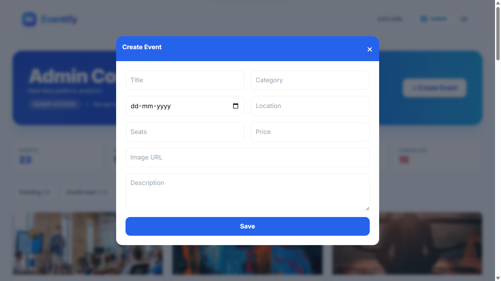
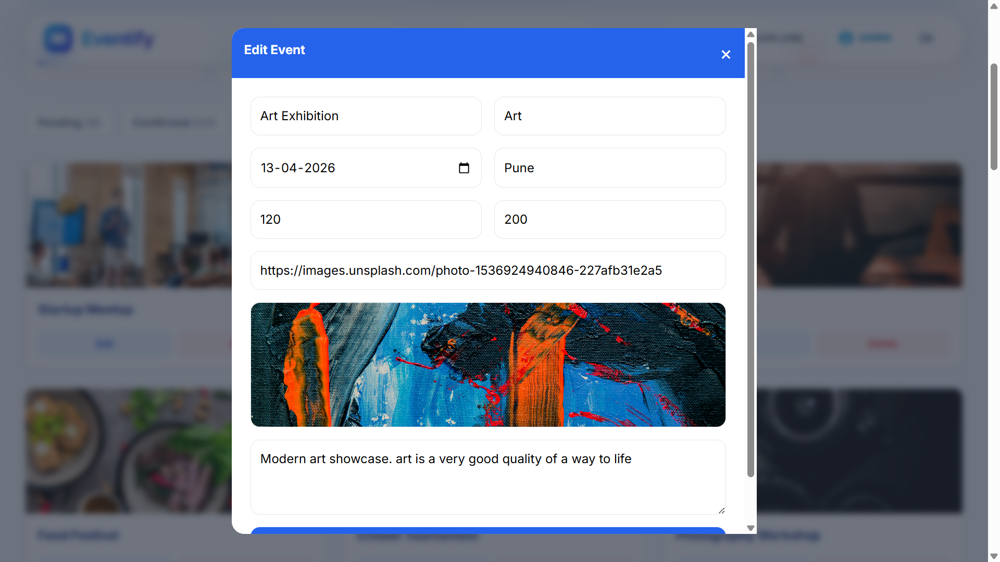
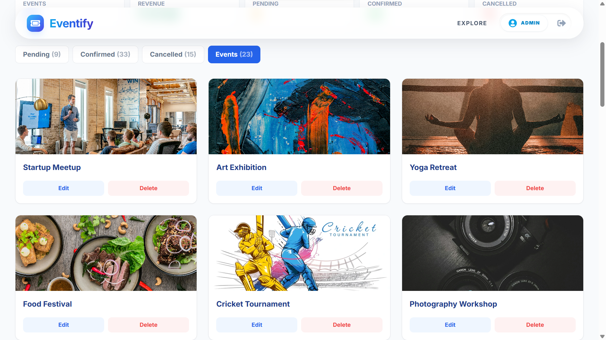

### 📦 Booking Management

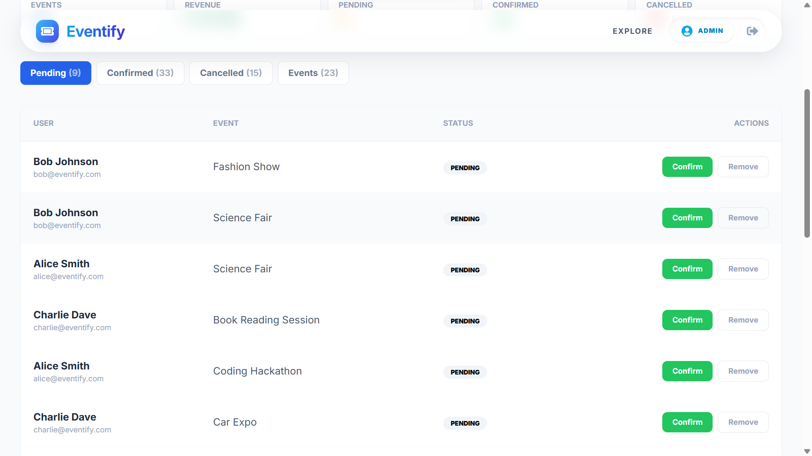
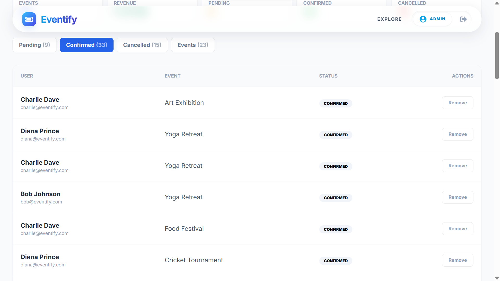
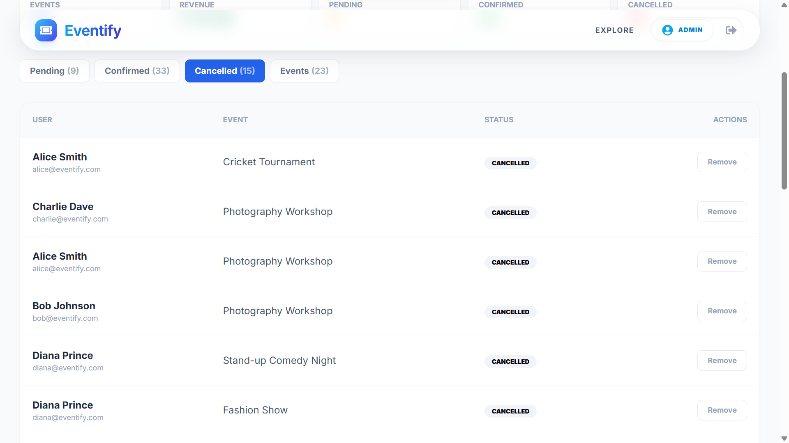

### 🎨 UI Components

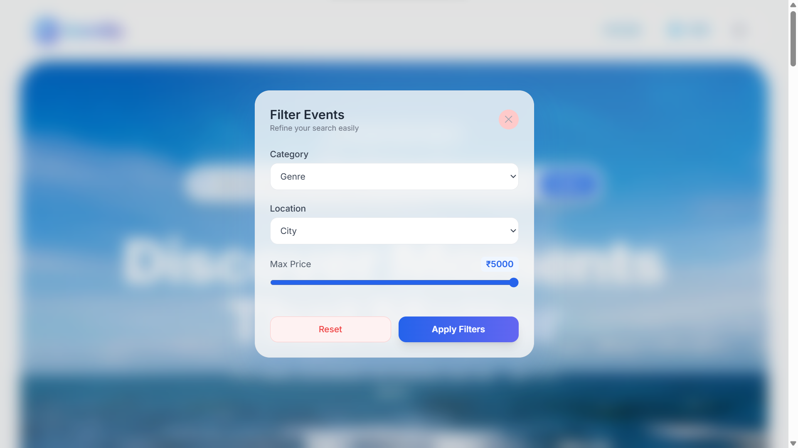
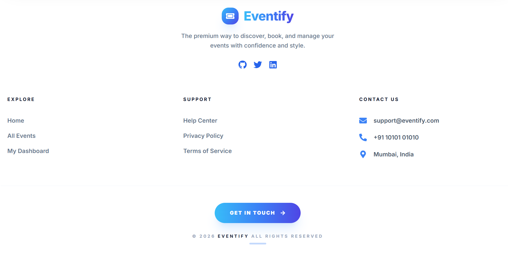

### ❌ Error Page

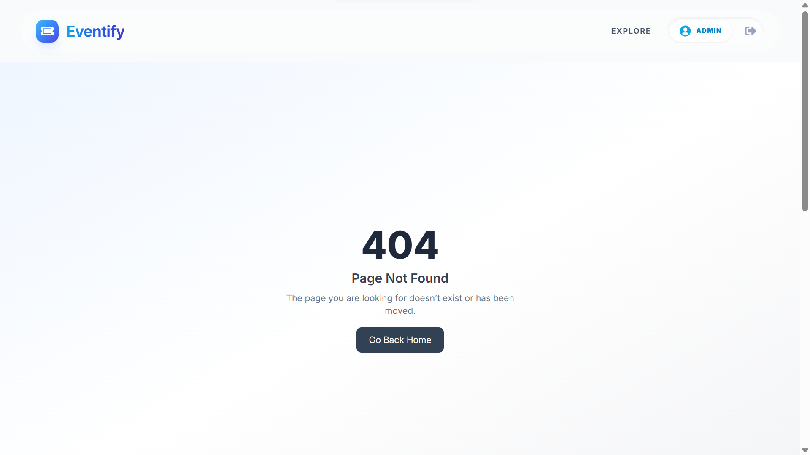


## 🙌 Author

👤 **Sourabh Bhalse**
🔗 https://github.com/Sourabh-Bhalse

---

## ⭐ Show your support

If you like this project, give it a ⭐ on GitHub!

